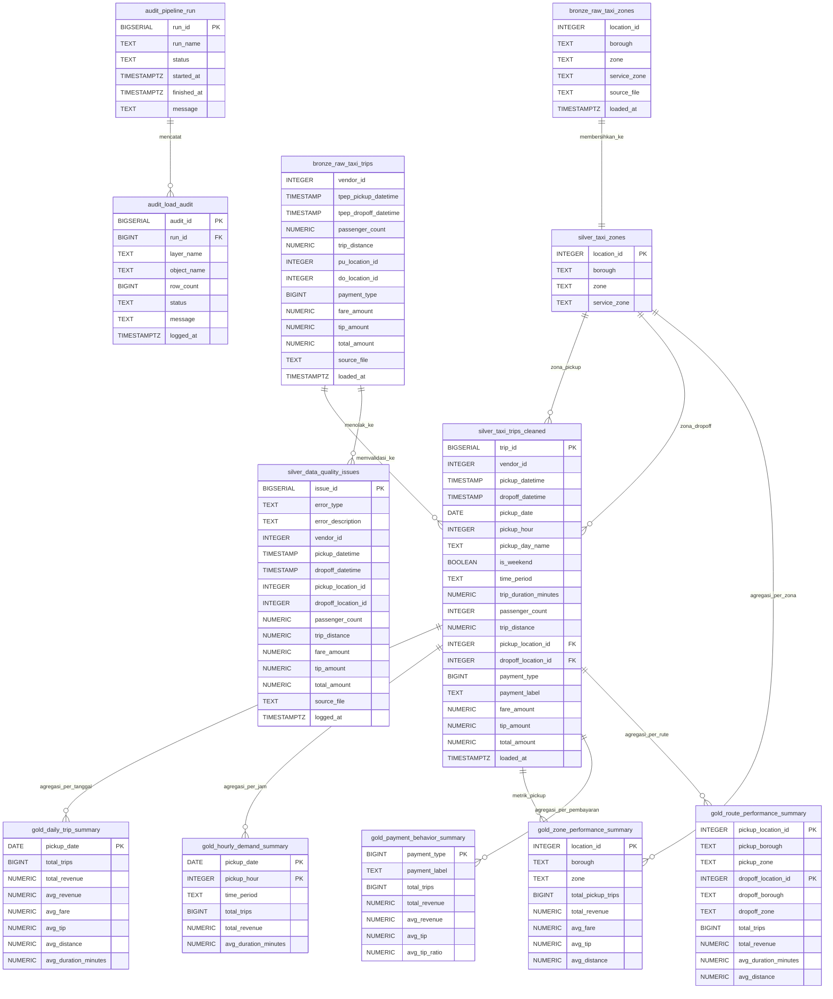

# ERD dan Desain Database

Database ini menggunakan model analitik berlapis:

- `bronze`: tabel staging mentah yang dimuat dari file sumber.
- `silver`: tabel analitik relasional yang dibersihkan dan divalidasi.
- `gold`: mart pelaporan teragregasi dan view kemudahan.
- `audit`: pelacakan eksekusi pipeline.

## ERD Utama

## Catatan Relasi

Tabel fakta analitik utama adalah `silver.taxi_trips_cleaned`. Tabel ini menyimpan trip yang tervalidasi dan terhubung ke `silver.taxi_zones` dua kali:

- `pickup_location_id` merujuk ke `silver.taxi_zones.location_id`
- `dropoff_location_id` merujuk ke `silver.taxi_zones.location_id`

Tabel `gold` adalah mart pelaporan yang didenormalisasi dan dibangun dari layer silver. Tabel-tabel ini bukan tabel transaksional mentah; melainkan output teragregasi yang dirancang untuk dashboard, laporan, dan pertanyaan bisnis.

## View

Proyek ini juga membuat view kemudahan di skema `gold`:

- `gold.vw_trip_enriched`: trip bersih yang digabung dengan nama zona pickup dan dropoff.
- `gold.vw_daily_trip_summary`: view passthrough di atas `gold.daily_trip_summary`.
- `gold.vw_zone_performance`: performa zona dengan aktivitas pickup dan dropoff.

View ini berada di atas tabel silver dan gold, sehingga tidak disertakan dalam ERD utama sebagai entitas fisik.

## Granularitas (Grain)

| Objek | Granularitas |
| --- | --- |
| `bronze.raw_taxi_trips` | Satu baris trip sumber mentah |
| `bronze.raw_taxi_zones` | Satu baris lookup zona taksi mentah |
| `silver.taxi_zones` | Satu zona taksi bersih per `location_id` |
| `silver.taxi_trips_cleaned` | Satu trip taksi tervalidasi |
| `silver.data_quality_issues` | Satu record sumber yang ditolak atau tidak valid |
| `gold.daily_trip_summary` | Satu baris per tanggal pickup |
| `gold.hourly_demand_summary` | Satu baris per tanggal dan jam pickup |
| `gold.zone_performance_summary` | Satu baris per zona pickup |
| `gold.payment_behavior_summary` | Satu baris per tipe pembayaran |
| `gold.route_performance_summary` | Satu baris per pasangan zona pickup dan dropoff |
| `audit.pipeline_run` | Satu eksekusi pipeline |
| `audit.load_audit` | Satu langkah pipeline yang dicatat |